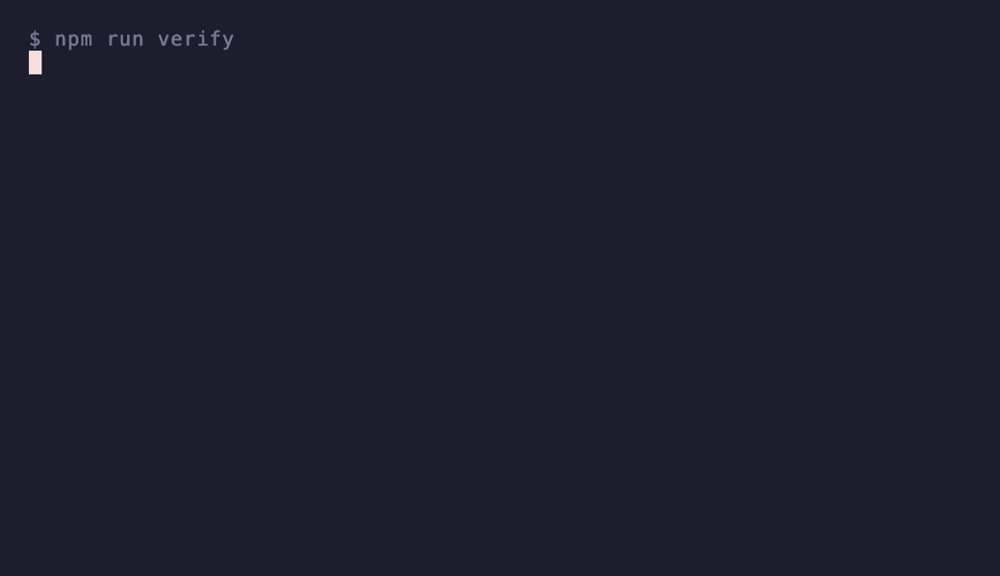

<!-- AUTO-GENERATED from the FlowStacks corpus. Do not edit this file directly.
     Suggest a workflow via a GitHub issue (.github/ISSUE_TEMPLATE) or at https://flowstacks.xyz/submit. -->

# Awesome AI Workflows

     

Like it? **Star the repo** so other builders can find workflows that actually still run.

Powered by <a href="https://flowstacks.xyz">FlowStacks</a>

A curated index of AI workflows that real builders actually run: agent harnesses, local-inference setups, RAG pipelines, coding-agent recipes, and automations. Most lists hand you code that worked _once_; every recipe here links to a page that shows whether it still works, and 123 of them are checked by CI on every change, not by hand.

Why "verified" is the whole point: AI recipes rot fast. Models change, flags break, packages move. A recipe that ran six months ago is a coin flip today. So we wire the deterministic parts of each recipe into CI, and when a step breaks, the badge drops.

## Contents

- [Coding and Code Review](#coding-and-code-review)
- [Agents and Orchestration](#agents-and-orchestration)
- [RAG and Knowledge](#rag-and-knowledge)
- [Research](#research)
- [Automation](#automation)
- [Local Inference](#local-inference)
- [Security](#security)
- [Content](#content)
- [Tools indexed](#tools-indexed)
- [How verification works](#how-verification-works)

## Coding and Code Review

- [Turn a Hand-Drawn UI into Working Code with tldraw](https://flowstacks.xyz/workflows/tldraw-make-real-sketch-to-code) - Sketch a screen on an infinite canvas and have a vision model return a live, working version of it. `✓ CI-verified`. Stack: tldraw, Claude Code.
- [Pi: The Safe Diff Reviewer](https://flowstacks.xyz/workflows/pi-safe-diff-reviewer) - A code reviewer that reads your staged diff and structurally cannot modify it. `✓ CI-verified`. Stack: Pi.
- [Pi: The Reusable Prompt Template](https://flowstacks.xyz/workflows/pi-reusable-prompt-template) - Turn a prompt you retype into a permanent Pi slash command. `✓ CI-verified`. Stack: Pi.
- [Pi: The Reusable Team Skill](https://flowstacks.xyz/workflows/pi-reusable-team-skill) - Encode a multi-step task once as an Agent Skill your whole team installs. `✓ CI-verified`. Stack: Pi.
- [Self-Healing Test Loop: an Agent that Fixes Until Green](https://flowstacks.xyz/workflows/self-healing-test-loop) - Wrap a coding agent in a bounded loop that re-runs your tests and fixes the code until the suite passes or it runs out of attempts. `✓ CI-verified`. Stack: Claude Code, Codex (OpenAI).
- [Agent Review Gate: a Schema-Forced Approve or Block in CI](https://flowstacks.xyz/workflows/agent-review-quality-gate) - Run a coding agent as a read-only reviewer that returns a schema-forced approve/block verdict, and let CI fail the merge on block. `✓ CI-verified`. Stack: Claude Code, Codex (OpenAI).
- [Codex: Screenshot to a Live Vite + React Landing Page](https://flowstacks.xyz/workflows/codex-screenshot-to-landing-page) - Hand Codex a screenshot or a brief and have it build a responsive Vite + React landing page, then deploy a Vercel preview and return the URL. `✓ CI-verified`. Stack: Codex (OpenAI), Vercel, Vite.
- [Codex: A Data File to a Live Next.js + Recharts Dashboard](https://flowstacks.xyz/workflows/codex-data-file-to-live-dashboard) - Point Codex at a JSON file and have it build a Next.js + Recharts dashboard, then deploy a Vercel preview and return the link. `✓ CI-verified`. Stack: Codex (OpenAI), Vercel, Next.js.
- [Codex: A Markdown Folder to a Live Docusaurus Docs Site](https://flowstacks.xyz/workflows/codex-markdown-to-docs-site) - Drop a folder of markdown into a Docusaurus project and have Codex assemble the site, fix broken links, then deploy a Vercel preview. `✓ CI-verified`. Stack: Codex (OpenAI), Vercel, Docusaurus.
- [Cline + Fable 5: Build or Fix Something Without Writing Code](https://flowstacks.xyz/workflows/cline-fable5-build-in-editor) - Use a coding agent inside VS Code that builds and fixes code while you just describe what you want, powered by Fable's stamina. `✓ CI-verified`. Stack: Cline.
- [Aider + Fable 5: Codebase-Wide Migrations from Your Terminal](https://flowstacks.xyz/workflows/aider-fable5-codebase-migration) - Point Fable 5 at a repo and let Aider refactor across hundreds of files as real Git commits you can undo. `✓ CI-verified`. Stack: Aider.
- [OpenHands + Fable 5: Autonomous Issue to Pull Request](https://flowstacks.xyz/workflows/openhands-fable5-issue-to-pr) - Hand Fable 5 a GitHub issue and let OpenHands plan, edit, run tests, and open a PR in a Docker sandbox. `✓ CI-verified`. Stack: OpenHands.
- [Repomix + Fable 5: Pack a Repo for a Long-Context Review](https://flowstacks.xyz/workflows/repomix-fable5-longcontext-review) - Flatten an entire codebase into a single file and let Fable 5 hold all of it at once for a whole-system review. `✓ CI-verified`. Stack: Repomix.
- [OpenCode: a read-only Plan pass that cannot touch your files](https://flowstacks.xyz/workflows/opencode-plan-before-build) - Separate think from touch: lock the plan agent to read-only (edit + bash deny) so it proposes before it edits, then Tab into build to execute. `✓ CI-verified`. Stack: OpenCode.
- [OpenCode: a model-routed team, cheap to plan, strong to build](https://flowstacks.xyz/workflows/opencode-model-routed-team) - Give each agent its own model so planning and review run on a cheap model and only the build runs on your best one. `✓ CI-verified`. Stack: OpenCode.
- [OpenCode: a reviewer subagent gated to exactly the Git commands you allow](https://flowstacks.xyz/workflows/opencode-gated-reviewer-subagent) - Define a Markdown agent whose bash access is scoped per command (Git diff and grep yes, everything else no) and that can never write. `✓ CI-verified`. Stack: OpenCode.
- [OpenCode: run it headless in scripts and CI, with JSON output](https://flowstacks.xyz/workflows/opencode-headless-ci-run) - Use opencode run non-interactively with --format json and a read-only agent so a pipeline gets machine-readable events and can never edit or execute. `✓ CI-verified`. Stack: OpenCode.
- [OpenCode: add an MCP tool, then lock it to one agent](https://flowstacks.xyz/workflows/opencode-scoped-mcp-tool) - Plug in an MCP server (live docs via Context7) but disable it globally and switch it on only for the one agent that needs it, so it does not burn tokens every turn. `✓ CI-verified`. Stack: OpenCode, Context7.
- [Kilo Code: ship a big feature as isolated subtasks with Orchestrator](https://flowstacks.xyz/workflows/kilocode-orchestrator-isolated-subtasks) - Define the orchestrator's delegate modes (architect, code, debug) so a large task runs as isolated subtasks, each in its own clean context. `✓ CI-verified`. Stack: Kilo Code.
- [Kilo Code: a mode that can only edit the files you let it](https://flowstacks.xyz/workflows/kilocode-file-scoped-mode) - Build a docs mode that can read the whole repo but only write to Markdown, using a fileRegex restriction on the edit group. `✓ CI-verified`. Stack: Kilo Code.
- [Kilo Code: add an MCP tool and bind it to one mode](https://flowstacks.xyz/workflows/kilocode-scoped-mcp-mode) - Enable an MCP server's tools only on the mode that needs it (a researcher), so its tool definitions don't load into every conversation and burn tokens. `✓ CI-verified`. Stack: Kilo Code.
- [OrcaRouter for coding: judge by passing tests, not by vibes](https://flowstacks.xyz/workflows/orcarouter-tests-pass-coding) - Fan a hard coding task out to a panel and keep the candidate whose patch actually passes your tests, using the tests_pass arbiter. `✓ CI-verified`. Stack: OrcaRouter.
- [codebase-memory-mcp: wire the knowledge graph, stop re-reading files](https://flowstacks.xyz/workflows/codebase-memory-mcp-token-savings) - Point your MCP client at a codebase-memory-mcp server so your coding agent queries the repo's knowledge graph instead of re-reading files into context on every question, cutting token spend without changing answer quality. `✓ CI-verified`. Stack: codebase-memory-mcp.
- [Run GLM-5.2 for the bulk, escalate the hard turns to Opus 4.8](https://flowstacks.xyz/workflows/glm-52-route-bulk-escalate-opus) - Wire a cost-routing config that sends most work to cheap hosted GLM-5.2 and only the hardest turns to Opus 4.8, instead of paying Opus prices for everything. `✓ CI-verified`. Stack: GLM-5.2, OpenRouter.
- [One AGENTS.md, no drift: prove CLAUDE.md is a real symlink and the generated files are in sync](https://flowstacks.xyz/workflows/agents-md-one-source-no-drift) - Keep one AGENTS.md as the single source of agent rules, symlink CLAUDE.md to it, and prove with CI that the symlink is committed as a symlink (not a Windows-materialised copy) and that any generated per-tool file byte-matches a fresh regeneration from the source, so nothing silently drifts. `✓ CI-verified`.
- [Self-host CodeWiki on private code: validate the config before you spend tokens](https://flowstacks.xyz/workflows/codewiki-selfhost-config-validate) - Configure the open-source FSoft CodeWiki to generate architecture-aware docs on your own machine (so private code never leaves it), and validate the provider and model config before a full, token-spending run. `✓ CI-verified`. Stack: CodeWiki (FSoft).
- [Persistent Memory for Codex using Obsidian](https://flowstacks.xyz/workflows/persistent-memory-codex-obsidian) - Give Codex durable, searchable long-term memory backed by an Obsidian vault. `author-tested`. Stack: Codex (OpenAI), Obsidian.

## Agents and Orchestration

- [Obsidian Vault as the Core of Your Agent Harness](https://flowstacks.xyz/workflows/obsidian-agent-harness) - Use an Obsidian vault as the shared memory and control surface for your agents. `✓ CI-verified`. Stack: Obsidian, Hermes Agent, Claude Code.
- [Meeting Processor: Raw Dump to Structured Note](https://flowstacks.xyz/workflows/obsidian-claude-meeting-processor) - Paste a raw meeting dump into your vault and have Claude turn it into action items, decisions, and links. `✓ CI-verified`. Stack: Obsidian, obsidian-mcp, Claude Desktop.
- [Hermes Kanban: The Research-to-Draft Relay](https://flowstacks.xyz/workflows/hermes-kanban-research-to-draft-relay) - Two researchers work in parallel, then a writer's card unblocks once both finish. `✓ CI-verified`. Stack: Hermes Agent.
- [Hermes Kanban: The Idempotent Nightly Review](https://flowstacks.xyz/workflows/hermes-kanban-idempotent-nightly-review) - A task that files itself onto the board every night and never double-books. `✓ CI-verified`. Stack: Hermes Agent.
- [Hermes Kanban: The Swarm](https://flowstacks.xyz/workflows/hermes-kanban-the-swarm) - Fan a goal out to N parallel workers, gate a verifier on all of them, then a synthesizer on the verifier. `✓ CI-verified`. Stack: Hermes Agent.
- [Obsidian × MCPVault: The Project Kickoff Generator](https://flowstacks.xyz/workflows/mcpvault-project-kickoff-generator) - Hand Claude your goals and constraints and have it scaffold a whole project folder from what your vault already knows. `✓ CI-verified`. Stack: Obsidian, MCPVault, Claude Desktop.
- [Mnemosyne: Fully Local Agent Memory, No Cloud at All](https://flowstacks.xyz/workflows/mnemosyne-local-first-agent-memory) - Give your agent persistent memory in a single SQLite file: store a fact, recall it by keyword, fully offline. `✓ CI-verified`. Stack: Mnemosyne.
- [Mem0: A Personalization Layer Your Assistant Remembers With](https://flowstacks.xyz/workflows/mem0-personalization-memory-layer) - Add user, session, and agent-level memory to an assistant so it remembers preferences across conversations. `✓ CI-verified`. Stack: Mem0.
- [Graphiti: A Temporal Graph for What Was True When](https://flowstacks.xyz/workflows/graphiti-temporal-graph-memory) - Stand up the bi-temporal context-graph engine behind Zep on a local FalkorDB, with indices built and ready for episodes. `✓ CI-verified`. Stack: Graphiti, FalkorDB.
- [Letta: An Agent That Manages Its Own Memory](https://flowstacks.xyz/workflows/letta-agent-managed-memory) - Install the Letta CLI and SDK, the MemGPT lineage where the agent edits its own memory blocks like an OS pages memory. `✓ CI-verified`. Stack: Letta.
- [Letta + Fable 5: Persistent Memory for Multi-Week Projects](https://flowstacks.xyz/workflows/letta-fable5-persistent-memory) - Give Fable 5 a memory that survives restarts via Letta's structured memory blocks, so a project runs for weeks, not one session. `✓ CI-verified`. Stack: Letta.
- [Hermes on MiMo-V2.5: a 1M-context agent for pennies](https://flowstacks.xyz/workflows/hermes-mimo-v25-default-driver) - Set MiMo-V2.5 as your everyday Hermes model: 1M context at $0.14/$0.28 per 1M tokens, with tool-use enforcement on for a non-GPT model. `✓ CI-verified`. Stack: Hermes Agent, Xiaomi MiMo.
- [Hermes + DeepSeek V4 Flash: a one-line reasoning-effort throttle](https://flowstacks.xyz/workflows/hermes-deepseek-v4-flash-effort-throttle) - Run one model from cheap-and-fast to deep-and-careful with a single reasoning_effort setting, so you don't pay for deep thinking on easy turns. `✓ CI-verified`. Stack: Hermes Agent, DeepSeek V4.
- [Hermes: offload background jobs to MiMo-V2-Flash and cut your main bill](https://flowstacks.xyz/workflows/hermes-mimo-v2-flash-auxiliary-offload) - Route Hermes' cheap, high-volume auxiliary work (compression, vision, web-extract) to MiMo-V2-Flash so your expensive main model only handles real reasoning. `✓ CI-verified`. Stack: Hermes Agent, Xiaomi MiMo.
- [Hermes: a scheduled agentic briefing on Hy3-preview](https://flowstacks.xyz/workflows/hermes-hy3-preview-scheduled-briefing) - Schedule a hands-off tool-using job (search, summarize, deliver) on the cheap, agentic Hy3-preview model, validated cron + config. `✓ CI-verified`. Stack: Hermes Agent, Tencent Hy3.
- [Hermes + Mnemosyne: give the cheap agent a local memory](https://flowstacks.xyz/workflows/hermes-mnemosyne-persistent-memory) - Wire Mnemosyne into Hermes as an MCP server so a budget model stops re-stuffing the same context every session, validated config + a real remember→recall round-trip. `✓ CI-verified`. Stack: Hermes Agent, Mnemosyne.
- [OKF: turn your repo's tribal knowledge into a bundle your agent reads first](https://flowstacks.xyz/workflows/okf-repo-knowledge-bundle) - Write one markdown concept per thing worth knowing, cross-linked, as a conformant OKF bundle in version control that any agent can read with no SDK. `✓ CI-verified`. Stack: Open Knowledge Format (OKF).
- [OKF: generate a bundle from your schema, then ground it with citations](https://flowstacks.xyz/workflows/okf-generate-and-ground-bundle) - Mirror Google's reference pattern: a model drafts one OKF concept per table or module, and a stricter project rule requires a # Citations section on anything with a resource, so the knowledge is checkable, not just plausible. `✓ CI-verified`. Stack: Open Knowledge Format (OKF).
- [OKF: consume a bundle without blowing your context window](https://flowstacks.xyz/workflows/okf-progressive-disclosure-consumer) - Use index.md for progressive disclosure so an agent navigates the graph instead of swallowing the whole folder, with reserved files that follow the spec. `✓ CI-verified`. Stack: Open Knowledge Format (OKF).
- [Hermes + OKF: a knowledge folder your agent reads before it answers](https://flowstacks.xyz/workflows/hermes-okf-knowledge-bundle) - Wire an OKF knowledge bundle into Hermes so the agent reads knowledge/index.md first, validated bundle conformance + a SOUL.md house rule that points at it. `✓ CI-verified`. Stack: Hermes Agent, Open Knowledge Format (OKF).
- [Rebuild Fable 5's deep-research fan-out on your own keys (OrcaRouter)](https://flowstacks.xyz/workflows/orcarouter-research-fanout) - Fan a research prompt out to a panel of models you choose, then fuse or judge the answers with an arbiter, in a routing DSL you version and control. `✓ CI-verified`. Stack: OrcaRouter.
- [OrcaRouter: only fan out when it is worth it](https://flowstacks.xyz/workflows/orcarouter-gated-fanout) - Gate the expensive fan-out behind a difficulty condition so easy chat stays cheap and only hard requests pay for a panel. `✓ CI-verified`. Stack: OrcaRouter.
- [Eve: gate the dangerous tool behind a human, in one field](https://flowstacks.xyz/workflows/eve-approval-gated-tool) - Make an Eve agent's irreversible tool stop and wait for a person above a threshold, using the needsApproval predicate, and verify the file is shaped right before you trust it. `✓ CI-verified`. Stack: Eve.
- [Eve: make evals the deploy gate, not a vibe check](https://flowstacks.xyz/workflows/eve-evals-as-ci-gate) - Write a file-based Eve eval that asserts a large refund routes through approval, and wire eve eval into CI so a prompt change can't ship a regression. `✓ CI-verified`. Stack: Eve.
- [Run GLM-5.2 fully local on a Mac Studio and drive it with Hermes](https://flowstacks.xyz/workflows/glm-52-mac-studio-hermes) - Serve GLM-5.2's 2-bit GGUF on a Mac Studio over an OpenAI-compatible endpoint, point Hermes at it as a custom provider, and hand it long hands-off agentic jobs. `✓ CI-verified`. Stack: Hermes Agent, GLM-5.2, LM Studio.
- [Sakana Fugu: A/B it on your own task before you migrate](https://flowstacks.xyz/workflows/fugu-openai-endpoint-eval) - Point an OpenAI-compatible client at the Fugu endpoint and compare it to a single strong model on one hard task you already know the answer to, instead of trusting a benchmark chart. `✓ CI-verified`. Stack: Sakana Fugu.
- [Build the Fugu pattern in the open: fan out, assign roles, verify](https://flowstacks.xyz/workflows/diy-orchestrate-and-verify) - Run the idea under Fugu, a panel of models with roles and a verifier or a tests-passing arbiter, with your own keys and every hop visible, so the black box is a choice and not a lock-in. `✓ CI-verified`. Stack: OrcaRouter.
- [Flue: define a sandboxed headless agent and deploy it anywhere](https://flowstacks.xyz/workflows/flue-sandbox-agent-deploy) - Author a Flue agent manifest that runs each agent in a sandbox instead of a dedicated container, keeping infra costs flat as task volume grows, and validate the config before you deploy. `✓ CI-verified`. Stack: Flue.
- [FreeLLMAPI: one socket, sixteen free model tiers with auto-fallback](https://flowstacks.xyz/workflows/freellmapi-unified-free-models) - Front the free tiers of many providers with a single OpenAI-compatible endpoint and a prioritized fallback chain, so your apps point at one key and the router switches providers automatically when one runs out for the day. `✓ CI-verified`. Stack: FreeLLMAPI.
- [Text your own AI assistant on WhatsApp: Hermes wired to FreeLLMAPI](https://flowstacks.xyz/workflows/hermes-whatsapp-freellm-assistant) - Point Hermes Agent at a FreeLLMAPI backend and connect it to WhatsApp, so a memory-keeping assistant runs 24/7 on a free always-on server and costs nothing per message, with the wiring validated before you link a number. `✓ CI-verified`. Stack: Hermes Agent, FreeLLMAPI.
- [Hermes /learn: author a reusable skill from a source, not by hand](https://flowstacks.xyz/workflows/hermes-learn-skill-from-source) - Use Hermes Agent's /learn to turn a doc, a repo, or a workflow you just performed into a standards-compliant SKILL.md (and an automatic slash command), instead of hand-writing a skill file that drifts from the real docs. `✓ CI-verified`. Stack: Hermes Agent.
- [Write an agent loop in code with smolagents (sandboxed)](https://flowstacks.xyz/workflows/smolagents-code-agent-loop) - Stand up a smolagents CodeAgent that writes Python to act instead of emitting JSON tool calls, and run that model-written code in a sandbox, not on your machine. `✓ CI-verified`. Stack: smolagents, E2B.
- [DSPy: program the pipeline, compile the prompts (stop hand-tuning)](https://flowstacks.xyz/workflows/dspy-compile-prompts) - Define an agent step as a DSPy program with a signature, a module, and a metric, so an optimizer improves the prompts against your metric instead of you fiddling by hand. `✓ CI-verified`. Stack: DSPy.
- [E2B: run model-written code in a sandbox, not on your box](https://flowstacks.xyz/workflows/e2b-sandbox-untrusted-code) - Execute AI-generated code in an isolated E2B cloud sandbox with the API key read from the environment, so untrusted code never touches your laptop or prod. `✓ CI-verified`. Stack: E2B.
- [promptfoo: make agent evals fail the build, not the user](https://flowstacks.xyz/workflows/promptfoo-evals-in-ci) - Write a declarative promptfoo config with real assertions and wire promptfoo eval into CI, so a regression in prompt or agent behavior fails a check instead of reaching production. `✓ CI-verified`. Stack: promptfoo.
- [Hermes MoA: stack frontier models into one virtual model for hard turns](https://flowstacks.xyz/workflows/hermes-moa-virtual-model) - Configure a Mixture-of-Agents preset in Hermes so several models answer in parallel and an aggregator writes the final response, and validate the preset before you spend double the tokens on it. `✓ CI-verified`. Stack: Hermes Agent.
- [Voyager pattern: validate a procedural skill store before you trust a saved skill](https://flowstacks.xyz/workflows/voyager-skill-library-pattern) - Capture a working routine as a named, described skill entry and validate the skill-library structure, so saved skills are findable and reviewable before an agent reuses them. `✓ CI-verified`. Stack: Voyager.
- [Wire GLM-5.2 into Hermes: valid route, 64k-context check, no key in config](https://flowstacks.xyz/workflows/hermes-glm-52-provider-config) - Validate a Hermes Agent config that runs GLM-5.2 through a real provider route (direct Z.AI or OpenRouter), clears Hermes's 64k minimum context, and keeps the API key out of config.yaml, before you start a session. `✓ CI-verified`.
- [WebMCP: declare a site's agent tools, and gate the ones that spend money](https://flowstacks.xyz/workflows/webmcp-tool-manifest-confirm-gate) - Publish a WebMCP tool manifest so an agent calls named site tools instead of guessing at buttons, and validate that every tool has a real schema and every sensitive tool (pay, checkout, delete) requires a human confirmation before it runs. `✓ CI-verified`. Stack: WebMCP.
- [Verify an agent-skills plugin before you ship or install it](https://flowstacks.xyz/workflows/verify-a-skills-plugin-before-you-ship) - Check that a Claude Code / agentskills.io skills package is structurally valid, every SKILL.md has proper frontmatter and a name matching its folder, and the plugin marketplace manifest parses, so a broken skill never fails to load after you publish it. `✓ CI-verified`. Stack: Agent Skills.
- [Wire the DeepWiki MCP into your agent so it looks up repos instead of hallucinating](https://flowstacks.xyz/workflows/deepwiki-mcp-repo-context) - Give your coding agent the DeepWiki MCP server so it can pull real context about an unfamiliar dependency mid-task, and validate the client config declares the three documented tools before you trust it. `✓ CI-verified`. Stack: DeepWiki.
- [Validate a WrenAI semantic model's references before an agent queries through it](https://flowstacks.xyz/workflows/wren-semantic-model-referential-integrity) - Before letting an agent query through WrenAI's governed semantic layer (MDL), validate that every relationship and metric resolves to a model and column that actually exist, so a stale definition fails a check instead of quietly returning wrong-but-plausible numbers. `✓ CI-verified`.
- [One shared memory for every coding agent: prove the configs actually point at the same server](https://flowstacks.xyz/workflows/shared-memory-one-server-many-agents) - Wire a Markdown memory MCP server (Basic Memory or an Obsidian MCP) into Claude Code, Cursor and Cline, and prove with CI that all three resolve to one server, that a write-the-memory house rule exists, and that the vault is under Git before any agent gets write access. `✓ CI-verified`.
- [Self-Hosted Self-Improving Agent with Hermes](https://flowstacks.xyz/workflows/hermes-self-improving-agent) - Stand up a Hermes agent that remembers and improves over time on your own VPS. `author-tested`. Stack: Hermes Agent, Hetzner VPS, Ollama.
- [Fine-Tune an Open LLM to Make It Yours](https://flowstacks.xyz/workflows/fine-tune-llm-make-it-yours) - Adapt an open-weight model to your domain with a small dataset. `author-tested`. Stack: vLLM.

## RAG and Knowledge

- [Research Ingestion: File a Source Into Your Knowledge Base](https://flowstacks.xyz/workflows/obsidian-claude-research-ingestion) - Paste an article or transcript into your vault and have Claude summarize, link, and flag contradictions. `✓ CI-verified`. Stack: Obsidian, obsidian-mcp, Claude Desktop.
- [Idea Cross-Pollinator: Find the Links You'd Never Spot](https://flowstacks.xyz/workflows/obsidian-claude-idea-cross-pollinator) - Have Claude search your whole vault and surface non-obvious connections to an idea. `✓ CI-verified`. Stack: Obsidian, mcp-obsidian, Obsidian Local REST API, Claude Desktop.
- [Obsidian × MCPVault: The Book Notes System](https://flowstacks.xyz/workflows/mcpvault-book-notes-system) - Dump your highlights and have Claude file the book into your second brain with connections and project-tied takeaways. `✓ CI-verified`. Stack: Obsidian, MCPVault, Claude Desktop.
- [Obsidian × MCPVault: The Argument Builder](https://flowstacks.xyz/workflows/mcpvault-argument-builder) - Give Claude a thesis and have it assemble a sourced, ranked argument from everything you've ever written. `✓ CI-verified`. Stack: Obsidian, MCPVault, Claude Desktop.
- [Obsidian × MCPVault: Read a Note from Any MCP Client](https://flowstacks.xyz/workflows/mcpvault-read-note-any-mcp-client) - Read a note from your Obsidian vault through MCPVault, from any MCP client, including a fully local LM Studio + open-model setup. `✓ CI-verified`. Stack: Obsidian, MCPVault, LM Studio.
- [Obsidian × MCPVault: Write a Note from Any MCP Client](https://flowstacks.xyz/workflows/mcpvault-write-note-any-mcp-client) - Create or patch a note in your Obsidian vault through MCPVault, from any MCP client, with frontmatter preserved. `✓ CI-verified`. Stack: Obsidian, MCPVault, LM Studio.
- [Cognee: Knowledge-Graph Memory Over Your Documents](https://flowstacks.xyz/workflows/cognee-knowledge-graph-memory) - Ingest your documents into a vector index plus a knowledge graph, so an agent can search by meaning and by relationships. `✓ CI-verified`. Stack: Cognee.
- [Khoj + Fable 5: A Second Brain That Knows Your Notes](https://flowstacks.xyz/workflows/khoj-fable5-second-brain) - Point a self-hosted assistant at your documents so Fable 5 can answer from your own notes, not just the internet. `✓ CI-verified`. Stack: Khoj.
- [Crawl4AI: a page to clean, LLM-ready markdown (no API key)](https://flowstacks.xyz/workflows/crawl4ai-markdown-for-llm) - Write a Crawl4AI run script that turns a page into clean markdown with a cache mode set, and verify the script is valid and shaped right before you point it at a site. `✓ CI-verified`. Stack: Crawl4AI.
- [LlamaIndex: index your documents and query them at runtime](https://flowstacks.xyz/workflows/llamaindex-retrieval-memory-rag) - Point LlamaIndex at a document corpus and build a VectorStoreIndex so an agent can retrieve the relevant chunks at query time instead of stuffing everything into context. `✓ CI-verified`. Stack: LlamaIndex.
- [zvec: run vector search inside your app, no server, offline](https://flowstacks.xyz/workflows/zvec-in-process-vector-search) - Embed a vector database directly into your process with zvec, insert vectors, and query for nearest neighbors, with no separate server to run, config, or babysit. `✓ CI-verified`. Stack: zvec.
- [Vectorless RAG with PageIndex](https://flowstacks.xyz/workflows/vectorless-rag-pageindex) - Build high-accuracy RAG without embeddings, chunking, or a vector DB. `author-tested`. Stack: PageIndex, Ollama, DeepSeek V4.

## Research

- [Obsidian × MCPVault: The Decision Journal](https://flowstacks.xyz/workflows/mcpvault-decision-journal) - Log decisions with frontmatter, let Claude update the outcome safely, and read the patterns each quarter. `✓ CI-verified`. Stack: Obsidian, MCPVault, Claude Desktop.
- [Fabric + Fable 5: Get Through Your Reading Pile](https://flowstacks.xyz/workflows/fabric-fable5-reading-patterns) - Pipe any article, video transcript, or document into a prebuilt Fabric pattern and have Fable 5 summarize, extract, or analyze it in one line. `✓ CI-verified`. Stack: Fabric.
- [Track a tool's hype curve across any Substack (no API key)](https://flowstacks.xyz/workflows/substack-hype-tracker) - Count how often a tool or model is mentioned in a Substack's posts over time, so you can see a hype curve rise and fade, using only the public archive. `✓ CI-verified`. Stack: Substack.
- [Pick a model with evidence: a GitHub Models bake-off that fits the free cap](https://flowstacks.xyz/workflows/github-models-prompt-bakeoff) - Run the few prompts that actually matter across several models on GitHub Models' free tier, then keep the winner, with the daily call budget proven to fit before you start. `✓ CI-verified`. Stack: GitHub Models.
- [Read your token receipts right: volume and cost are different leaderboards](https://flowstacks.xyz/workflows/token-volume-vs-cost-receipts) - Attribute your model usage by both tokens and dollars, so you can see the flip the OpenRouter rankings show: cheap open models dominate volume while premium models dominate spend, and never mistake a high token ranking for value. `✓ CI-verified`. Stack: OpenRouter.
- [Hermes + NotebookLM "Second Brain"](https://flowstacks.xyz/workflows/hermes-notebooklm-second-brain) - Pair Hermes with NotebookLM to build a self-researching, self-teaching knowledge system. `author-tested`. Stack: Hermes Agent, NotebookLM, Obsidian. Replaces Perplexity Pro.

## Automation

- [Dedupe and Rank a Keyword List with Coreutils](https://flowstacks.xyz/workflows/dedupe-and-rank-a-keyword-list) - Turn a messy keyword dump into a clean, frequency-ranked list using only shell builtins. `✓ CI-verified`. Stack: GNU Coreutils.
- [Morning Synthesis: a Start-of-Day Note Before Coffee](https://flowstacks.xyz/workflows/obsidian-claude-morning-synthesis) - Schedule Claude Code to read your recent notes and write a daily start-of-day briefing. `✓ CI-verified`. Stack: Obsidian, Claude Code.
- [Weekly Review: a Finished Review Instead of a Blank Page](https://flowstacks.xyz/workflows/obsidian-claude-weekly-review) - Every Friday, have Claude Code turn your week's note activity into a written review. `✓ CI-verified`. Stack: Obsidian, Claude Code.
- [Obsidian × MCPVault: The Vault Health Check](https://flowstacks.xyz/workflows/mcpvault-vault-health-check) - A monthly, scheduled audit that finds orphan notes, stale info, and inconsistent tags before your vault rots. `✓ CI-verified`. Stack: Obsidian, MCPVault, Claude Code.
- [Claude Code /loop: Poll a Deploy on a Fixed Interval](https://flowstacks.xyz/workflows/claude-code-loop-scheduler) - Re-fire a prompt on a valid cron interval inside a live Claude Code session. `✓ CI-verified`. Stack: Claude Code.
- [Claude Code Headless: An Always-On Local Schedule](https://flowstacks.xyz/workflows/claude-code-headless-cron) - Run Claude Code headless with -p on an OS-cron schedule so a job survives restarts. `✓ CI-verified`. Stack: Claude Code.
- [Claude Code Cloud Schedule: Runs With Your Laptop Off](https://flowstacks.xyz/workflows/claude-code-cloud-schedule) - Schedule Claude Code on Anthropic-managed infra at 1-hour-or-coarser cadence, pushing only to claude/ branches. `✓ CI-verified`. Stack: Claude Code.
- [Firecrawl: turn a page into the exact JSON you asked for](https://flowstacks.xyz/workflows/firecrawl-extract-structured) - Author a Firecrawl extract request that returns schema-structured JSON (not just markdown) and validate the request shape before you spend a crawl on it. `✓ CI-verified`. Stack: Firecrawl.
- [Scrape politely: honor robots.txt and a crawl delay (the part most skip)](https://flowstacks.xyz/workflows/respectful-scraping-robots-ratelimit) - Gate any scraper behind a robots.txt check and a crawl delay so you only fetch what a site allows, at a rate it allows, using nothing but the Python standard library. `✓ CI-verified`. Stack: Scrapy.
- [Let a free model triage your reading: one-line summary + reply flag](https://flowstacks.xyz/workflows/openrouter-free-triage) - Point any OpenAI-compatible tool at an OpenRouter free model so each email/article/report comes back as a one-sentence summary plus a needs-reply flag, and you only open what earns it. `✓ CI-verified`. Stack: OpenRouter.
- [Teach OpenCode Go your weekly chore once, then run it in minutes](https://flowstacks.xyz/workflows/opencode-go-reusable-chore) - Capture a repeating chore as a reusable OpenCode command backed by the Go plan's models, so a two-hour weekly task becomes a five-minute run. `✓ CI-verified`. Stack: OpenCode.
- [Grind a huge one-time job overnight on a free tier's tiny rate limit](https://flowstacks.xyz/workflows/free-tier-overnight-batch) - Pace a big one-time batch (label a dataset, summarize an archive, draft alt text) through a free tier with a very low rate ceiling, proven to finish within the rate limit and the monthly token budget before you start it. `✓ CI-verified`. Stack: Mistral La Plateforme.
- [ReMe pattern: define prospective memory as a schedule your agent can tick off](https://flowstacks.xyz/workflows/reme-prospective-schedule) - Write a reminder schedule config that an agent can load to surface its own future obligations — follow-ups, timed checks, recurring digests — and validate the structure before wiring it up. `✓ CI-verified`. Stack: ReMe.
- [Route through a gateway with a tested open-weights fallback](https://flowstacks.xyz/workflows/model-failover-tested-open-fallback) - Keep model access from being a single point of failure: route through an OpenAI-compatible gateway and pin a fallback that is open-weights and has actually been tested, so a pulled or deprecated model is a two-minute config change, not a lost week. `✓ CI-verified`.
- [Advisor pattern: cap how often the expensive model gets called, and catch drift](https://flowstacks.xyz/workflows/advisor-pattern-call-budget-and-drift-check) - Run a cheap executor with a rarely-consulted expensive advisor, but enforce a hard cap on advisor calls per task and a drift-check before the executor can keep going, so the benchmark's 63% discount doesn't quietly erode into nothing. `✓ CI-verified`.
- [Chat with a CSV, but pin a known-answer guardrail so a wrong query cannot pass](https://flowstacks.xyz/workflows/chat-your-csv-known-answer-guardrail) - Ask a CSV or dataframe questions in plain English with PandasAI, but wrap it in a deterministic known-answer check so a confident-but-wrong generated query is caught instead of trusted. `✓ CI-verified`.
- [Self-hosting the open-source stack? Prove your backup actually restores before you need it](https://flowstacks.xyz/workflows/prove-your-backup-actually-restores) - Make the one self-hosting discipline that matters a machine check: back up your database, destroy the live copy, restore from the backup, and assert the restored data matches the original exactly, so you find a broken backup in CI instead of at 2am. `✓ CI-verified`.

## Local Inference

- [Local model chore: turn a brain-dump into a clean to-do list](https://flowstacks.xyz/workflows/local-llm-braindump-to-todo) - Paste messy meeting notes into a free, offline model on your own laptop and get back an organized to-do list, with nothing leaving the machine. `✓ CI-verified`. Stack: Ollama, Google Gemma 3.
- [Local model chore: summarize a long PDF without it leaving your laptop](https://flowstacks.xyz/workflows/local-llm-summarize-pdf-private) - Attach a 30-page PDF or a dense terms-of-service to a local model and get five plain bullets plus anything you need to act on, with the document staying on your machine. `✓ CI-verified`. Stack: Ollama, Google Gemma 3.
- [Local model chore: draft a sensitive message in private](https://flowstacks.xyz/workflows/local-llm-draft-sensitive-message) - Ask a free, offline model to draft or soften a delicate message (a note about money, a reply to a doctor, a careful complaint) knowing the contents stay on your machine. `✓ CI-verified`. Stack: Ollama, Google Gemma 3.
- [Local model chore: read a photo with a vision model, on-device](https://flowstacks.xyz/workflows/local-llm-read-a-photo-vision) - Snap a receipt, a medication label, or a handwritten note, and have a free offline vision model read out the details so you do not have to squint and retype. `✓ CI-verified`. Stack: Ollama, Google Gemma 3.
- [Serve MiniMax M3 yourself for agentic coding (vLLM)](https://flowstacks.xyz/workflows/serve-minimax-m3-coding) - Stand up MiniMax M3 on an 8x H200 node as an OpenAI-compatible endpoint and point any coding agent at it, validated serve flags + endpoint config. `✓ CI-verified`. Stack: vLLM, MiniMax M3.
- [Serve GLM-5.1 yourself for long-horizon agentic coding (vLLM)](https://flowstacks.xyz/workflows/serve-glm-51-coding) - Stand up the MIT-licensed GLM-5.1 FP8 checkpoint as an OpenAI-compatible endpoint for long agentic runs, validated serve config + endpoint. `✓ CI-verified`. Stack: vLLM, GLM-5.2.
- [Serve NVIDIA Nemotron 3 Ultra yourself for high-throughput agents (vLLM)](https://flowstacks.xyz/workflows/serve-nemotron-3-ultra-coding) - Stand up the NVFP4 Nemotron 3 Ultra checkpoint as an OpenAI-compatible endpoint for fast, long-running agent loops, validated serve flags + endpoint. `✓ CI-verified`. Stack: vLLM, NVIDIA Nemotron 3 Ultra.
- [Validate an Apple Core AI export entry and skill plugin before you touch a Mac](https://flowstacks.xyz/workflows/coreai-export-registry-and-plugin-check) - Check a Core AI model registry entry and the agent-skill plugin manifest offline, so you know the export recipe is well-formed before spending an evening on macOS 27. `✓ CI-verified`. Stack: Apple Core AI Models.
- [Unsloth: write parametric memory in with a fine-tune config](https://flowstacks.xyz/workflows/unsloth-parametric-finetune-config) - Write a valid Unsloth fine-tune config that bakes stable, always-needed domain knowledge into a small model so the knowledge is native rather than carried in a prompt on every call. `✓ CI-verified`. Stack: Unsloth.
- [Prove your meeting-notes pipeline never phones home (and gates on consent)](https://flowstacks.xyz/workflows/meeting-notes-pipeline-stays-local) - Run capture -> whisper.cpp transcription -> Ollama summary fully on your machine, with a CI check that every endpoint is loopback, no cloud host or API key appears anywhere in the config, and recording is gated on a consent acknowledgment. `✓ CI-verified`.
- [Local Voice-to-Text that Replaces WisprFlow](https://flowstacks.xyz/workflows/local-voice-to-text-replace-wisprflow) - Run fully local dictation with whisper.cpp instead of paying for WisprFlow. `author-tested`. Stack: whisper.cpp. Replaces WisprFlow.
- [Local Text-to-Speech that Replaces ElevenLabs](https://flowstacks.xyz/workflows/local-tts-replace-elevenlabs) - Generate natural speech locally with Piper instead of an ElevenLabs subscription. `author-tested`. Stack: Piper TTS. Replaces ElevenLabs.
- [Run LLMs Locally to Replace ChatGPT Plus](https://flowstacks.xyz/workflows/run-llms-locally-replace-chatgpt-plus) - Serve a capable open model locally with Ollama and drop the ChatGPT Plus subscription. `author-tested`. Stack: Ollama, DeepSeek V4. Replaces ChatGPT Plus.
- [Guaranteed JSON from Local LLMs with Outlines](https://flowstacks.xyz/workflows/structured-outputs-local-llm) - Force valid, schema-conformant JSON out of any local model. `author-tested`. Stack: Outlines, Ollama.

## Security

- [Claude Code: Lock Down an Unattended Run with Permission Rules](https://flowstacks.xyz/workflows/claude-code-permission-lockdown) - Define exactly what a scheduled or headless Claude Code run may do via settings.json permission rules. `✓ CI-verified`. Stack: Claude Code.
- [Claude Code Auto Mode: A Classifier Instead of an Allowlist](https://flowstacks.xyz/workflows/claude-code-auto-mode) - Set Auto Mode as your default so a classifier reviews each action instead of pre-listing every command. `✓ CI-verified`. Stack: Claude Code.
- [SkillSpector: fail your CI build on a risky agent skill](https://flowstacks.xyz/workflows/skillspector-ci-gate) - Scan every skill you did not write with SkillSpector and gate CI on the result, so a malicious or vulnerable SKILL.md fails the build instead of running with your agent's permissions at runtime. `✓ CI-verified`. Stack: SkillSpector.
- [Vet a SKILL.md before you install it](https://flowstacks.xyz/workflows/vet-agent-skill-before-install) - Treat an agent skill like the untrusted dependency it is: parse its SKILL.md, confirm the frontmatter is well-formed, and surface every executable script it bundles, since the research flagged script-bearing skills as the most dangerous, before you ever let your agent run it. `✓ CI-verified`. Stack: Agent Skills.
- [Agent-Reach: throwaway account, least privilege, scan before install](https://flowstacks.xyz/workflows/agent-reach-throwaway-and-scan) - Before letting Agent-Reach install system dependencies and register a skill that logs into platforms with your cookies, encode the safe defaults as a preflight manifest: a throwaway account never your main, cookie-auth risk acknowledged per platform, and a mandatory scan before install. `✓ CI-verified`. Stack: Agent-Reach, SkillSpector.
- [Vet the fine print a star count hides: real license and a gate on dual-use tools](https://flowstacks.xyz/workflows/vet-the-fine-print-before-you-build) - Before you build on a starred repo, record its actual license (not an assumed permissive one) and whether it is dual-use, so a custom license or an impersonation risk never surprises you after you have shipped. `✓ CI-verified`. Stack: MinerU.
- [Shepherd: prove an agent task is retained and least-privilege before it runs](https://flowstacks.xyz/workflows/shepherd-least-privilege-grants) - Declare an agent task's per-repo read/write grants and hold its output to one side (retained, not applied), then validate that nothing auto-applies and every write grant is explicit, before you run it. `✓ CI-verified`. Stack: Shepherd.

## Content

- [Postiz: Plan and Schedule a Week of Social Posts](https://flowstacks.xyz/workflows/postiz-plan-a-week-of-social-posts) - From one brief, have an agent draft per-channel posts and queue a non-colliding weekly schedule in self-hosted Postiz. `✓ CI-verified`. Stack: Postiz. Replaces Buffer.
- [LibreChat + Fable 5: Show It a Screenshot or a PDF](https://flowstacks.xyz/workflows/librechat-fable5-vision-chat) - Run a private, self-hosted ChatGPT-style app where you drop in an image or document and let Claude Fable 5 read it. `✓ CI-verified`. Stack: LibreChat.
- [OpenMontage: run a full AI video pipeline with zero paid APIs](https://flowstacks.xyz/workflows/openmontage-free-video-pipeline) - Wire OpenMontage's scripting-to-composition pipeline using only free sources (Piper TTS for narration, Archive.org/NASA/Wikimedia for footage, Pexels for images) so you pay nothing for the orchestration layer, and validate the pipeline config before you run it. `✓ CI-verified`. Stack: OpenMontage.
- [Swap to a cheap image model, but guard the cases it loses](https://flowstacks.xyz/workflows/image-gen-cheap-swap-with-text-guard) - Default image generation to a cheap model for general scenes, while proving the cases the premium model dominates (text in the frame, charts, precise layout) are still routed to it, so the swap saves money without quietly degrading the work that has words in it. `✓ CI-verified`. Stack: Wan (Alibaba).

## Tools indexed

The tools these workflows are built on. Maintainers: if your tool is listed and you'd like a workflow added or corrected, open a GitHub issue.

- [Hermes Agent](https://hermes-agent.nousresearch.com) - Used in 16 workflows.
- [Obsidian](https://obsidian.md) - Used in 15 workflows.
- [Claude Code](https://claude.com/claude-code) - Used in 12 workflows.
- [Ollama](https://ollama.com) - Used in 8 workflows.
- [Claude Desktop](https://claude.ai/download) - Used in 7 workflows.
- [MCPVault](https://github.com/bitbonsai/mcpvault) - Used in 7 workflows.
- Codex (OpenAI) - Used in 6 workflows.
- [OpenCode](https://opencode.ai) - Used in 6 workflows.
- [Google Gemma 3](https://ollama.com/library/gemma3) - Used in 4 workflows.
- [Open Knowledge Format (OKF)](https://github.com/GoogleCloudPlatform/knowledge-catalog) - Used in 4 workflows.
- [OrcaRouter](https://orcarouter.ai) - Used in 4 workflows.
- [vLLM](https://github.com/vllm-project/vllm) - Used in 4 workflows.
- DeepSeek V4 - Used in 3 workflows.
- [GLM-5.2](https://huggingface.co/unsloth/GLM-5.2-GGUF) - Used in 3 workflows.
- [Kilo Code](https://kilocode.ai) - Used in 3 workflows.
- [LM Studio](https://lmstudio.ai) - Used in 3 workflows.
- [OpenRouter](https://openrouter.ai) - Used in 3 workflows.
- [Pi](https://pi.dev) - Used in 3 workflows.
- [Vercel](https://vercel.com) - Used in 3 workflows.
- [Agent Skills](https://github.com/addyosmani/agent-skills) - Used in 2 workflows.
- [E2B](https://e2b.dev) - Used in 2 workflows.
- [Eve](https://vercel.com/docs/eve) - Used in 2 workflows.
- [FreeLLMAPI](https://freellmapi.co) - Used in 2 workflows.
- [Letta](https://www.letta.com) - Used in 2 workflows.
- [Mnemosyne](https://github.com/AxDSan/mnemosyne) - Used in 2 workflows.
- [obsidian-mcp](https://github.com/StevenStavrakis/obsidian-mcp) - Used in 2 workflows.
- [SkillSpector](https://github.com/NVIDIA/SkillSpector) - Used in 2 workflows.
- [Xiaomi MiMo](https://huggingface.co/XiaomiMiMo) - Used in 2 workflows.
- [Agent-Reach](https://github.com/Panniantong/Agent-Reach) - Used in 1 workflow.
- [Aider](https://aider.chat) - Used in 1 workflow.
- [Apple Core AI Models](https://github.com/apple/coreai-models) - Used in 1 workflow.
- [Cline](https://cline.bot) - Used in 1 workflow.
- [codebase-memory-mcp](https://github.com/DeusData/codebase-memory-mcp) - Used in 1 workflow.
- [CodeWiki (FSoft)](https://github.com/FSoft-AI4Code/CodeWiki) - Used in 1 workflow.
- [Cognee](https://www.cognee.ai) - Used in 1 workflow.
- [Context7](https://context7.com) - Used in 1 workflow.
- [Crawl4AI](https://crawl4ai.com) - Used in 1 workflow.
- [DeepWiki](https://deepwiki.com) - Used in 1 workflow.
- [Docusaurus](https://docusaurus.io) - Used in 1 workflow.
- [DSPy](https://github.com/stanfordnlp/dspy) - Used in 1 workflow.
- [Fabric](https://github.com/danielmiessler/fabric) - Used in 1 workflow.
- [FalkorDB](https://falkordb.com) - Used in 1 workflow.
- [Firecrawl](https://firecrawl.dev) - Used in 1 workflow.
- [Flue](https://github.com/withastro/flue) - Used in 1 workflow.
- [GitHub Models](https://github.com/marketplace/models) - Used in 1 workflow.
- [GNU Coreutils](https://www.gnu.org/software/coreutils/) - Used in 1 workflow.
- [Graphiti](https://github.com/getzep/graphiti) - Used in 1 workflow.
- [Hetzner VPS](https://hetzner.com) - Used in 1 workflow.
- [Khoj](https://khoj.dev) - Used in 1 workflow.
- [LibreChat](https://www.librechat.ai) - Used in 1 workflow.
- [LlamaIndex](https://www.llamaindex.ai) - Used in 1 workflow.
- [mcp-obsidian](https://github.com/MarkusPfundstein/mcp-obsidian) - Used in 1 workflow.
- [Mem0](https://mem0.ai) - Used in 1 workflow.
- [MinerU](https://mineru.net) - Used in 1 workflow.
- [MiniMax M3](https://huggingface.co/MiniMaxAI/MiniMax-M3) - Used in 1 workflow.
- [Mistral La Plateforme](https://mistral.ai) - Used in 1 workflow.
- [Next.js](https://nextjs.org) - Used in 1 workflow.
- [NotebookLM](https://notebooklm.google.com) - Used in 1 workflow.
- [NVIDIA Nemotron 3 Ultra](https://research.nvidia.com/labs/nemotron/Nemotron-3-Ultra/) - Used in 1 workflow.
- [Obsidian Local REST API](https://github.com/coddingtonbear/obsidian-local-rest-api) - Used in 1 workflow.
- [OpenHands](https://docs.openhands.dev) - Used in 1 workflow.
- [OpenMontage](https://github.com/calesthio/OpenMontage) - Used in 1 workflow.
- [Outlines](https://github.com/dottxt-ai/outlines) - Used in 1 workflow.
- PageIndex - Used in 1 workflow.
- [Piper TTS](https://github.com/rhasspy/piper) - Used in 1 workflow.
- [Postiz](https://postiz.com) - Used in 1 workflow.
- [promptfoo](https://promptfoo.dev) - Used in 1 workflow.
- [ReMe](https://github.com/agentscope-ai/ReMe) - Used in 1 workflow.
- [Repomix](https://repomix.com) - Used in 1 workflow.
- [Sakana Fugu](https://sakana.ai/fugu/) - Used in 1 workflow.
- [Scrapy](https://scrapy.org) - Used in 1 workflow.
- [Shepherd](https://shepherd-agents.ai) - Used in 1 workflow.
- [smolagents](https://huggingface.co/docs/smolagents) - Used in 1 workflow.
- [Substack](https://substack.com) - Used in 1 workflow.
- [Tencent Hy3](https://github.com/Tencent-Hunyuan/Hy3-preview) - Used in 1 workflow.
- [tldraw](https://tldraw.dev) - Used in 1 workflow.
- [Unsloth](https://unsloth.ai) - Used in 1 workflow.
- [Vite](https://vite.dev) - Used in 1 workflow.
- [Voyager](https://github.com/MineDojo/Voyager) - Used in 1 workflow.
- [Wan (Alibaba)](https://wan.video) - Used in 1 workflow.
- [WebMCP](https://developer.chrome.com/docs/ai/webmcp) - Used in 1 workflow.
- [whisper.cpp](https://github.com/ggerganov/whisper.cpp) - Used in 1 workflow.
- [zvec](https://zvec.org) - Used in 1 workflow.

## How verification works

Every recipe carries a badge that tells you exactly how far it has been checked.

`✓ CI-verified` means our CI runs the recipe's deterministic setup steps in an isolated environment and grades real fixtures on every change. If a step breaks, the badge drops automatically.

`author-tested` means the author ran it end to end and reported it working, but it is not wired into CI yet.

What we do not fake: the AI-generated step of a recipe (the part where a model produces output) is marked separately and is never claimed as machine-checked. We verify that the setup runs and the deterministic spine holds, not that a model's creativity is correct. That honesty is the point. Full methodology and live fixture results are on each recipe's page.

## Contributing

Built a workflow that works? [Submit it on FlowStacks](https://flowstacks.xyz/submit) or [suggest one via a GitHub issue](https://github.com/Neeeophytee/awesome-ai-workflows/issues/new/choose) and we will build and verify it. If it passes verification, it earns a badge, a permanent page, and a spot on this list. See [CONTRIBUTING.md](CONTRIBUTING.md) for what we look for.

Note: this README is generated from the verified corpus, so please do not edit it in a pull request directly. Open an issue or submit on the site instead, and it will appear here automatically once it passes CI.

License: [CC0-1.0](LICENSE). To the extent possible under law, the maintainers have waived all copyright to the selection and arrangement of this list. The linked workflows and the FlowStacks platform are separately licensed.
